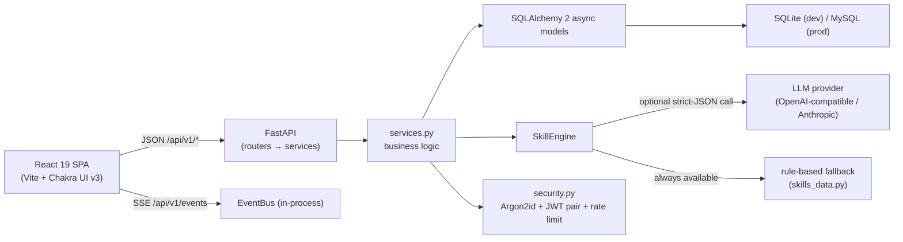

# Design: PragatiShala

The high-level and low-level design in one pass. This is the overview
layer: deep detail (auth internals, engine contracts, event flows) lives in
[architecture.md](architecture.md), decision records in [adr/](adr/), the
product story in the README and [PRD.md](PRD.md), and the engineering
history in [BUILD_LOG.md](../BUILD_LOG.md).

## 1. What the product does

A skill-development platform: a user describes their skills and experience
in free text, PragatiShala analyses it against a target role, scores
readiness, and generates a personalized learning path. Resumes can be
generated from the same profile, market insights are exposed, and every
state change streams to the UI over Server-Sent Events. AI features are
provider-agnostic: an optional LLM refines output, and a deterministic
rule-based engine guarantees the product works with zero API keys.

## 2. System shape (HLD)

Two-surface design like most FastAPI products, with three deliberate
boundaries:

1. **Routers never contain business logic.** They map domain errors to
   HTTP statuses; `services.py` owns rules and persistence.
2. **AI is a strategy, not a dependency.** Every AI feature computes a
   deterministic fallback first, optionally refines it through an LLM
   call validated against strict Pydantic schemas, and records which
   engine produced the stored result (`engine_used`). Verified live: the
   assessment endpoint reports `engine_used: rule_based` on a keyless run.
3. **Realtime is in-process SSE.** The EventBus fans out domain events to
   authenticated SSE streams; no external broker for prototype scope.

## 3. Primary data flow: assessment → learning path

1. The signed-in user submits a free-text skills narrative (20–8000 chars)
   with an optional target role.
2. `run_assessment` calls the SkillEngine: fallback analysis (skill
   vocabulary match against `skills_data.py`), optional LLM refinement,
   then persists an `Assessment` with `result` (skills, strengths, gaps,
   readiness score) and `engine_used`.
3. `generate_learning_path` turns the assessment into modules with
   estimated hours and milestones (same engine contract).
4. Both actions publish events; the user's SSE stream (and the profile
   page) reflect them without polling.

Verified end to end on 2026-09-18 against the real server: register →
login → assessment (201, `rule_based`, readiness scored) → learning path
(201, modules generated); see the screenshots in this folder and
STATUS-level numbers in the README.

## 4. Module breakdown (LLD)

### Backend (`backend/app/`)

| Module | Responsibility | Must not contain |
|---|---|---|
| `main.py` | App factory, router wiring, startup schema upgrades (ADR-0008) | Business logic |
| `routers/` | HTTP surface: auth, users, assessments, learning-paths, resumes, market, events, health | SQL, engine calls |
| `services.py` | Domain logic, ownership checks, persistence, event publishing | HTTP concerns |
| `models.py` / `schemas.py` | SQLAlchemy persistence / Pydantic transport contracts | Each other's concerns |
| `deps.py` | `Annotated` dependency aliases: session, current user, engine, bus | Business rules |
| `security.py` | Argon2id hashing, JWT pair encode/decode (typed claims, iss/aud/jti) | Storage |
| `ratelimit.py` | Login rate limiting (middleware) | Anything else |
| `ai/` | `SkillEngine`, providers, curated `skills_data.py` | Route handling |
| `config.py` | Pydantic Settings; env access centralized here | Scattered `os.environ` |

### Frontend (`frontend/src/`)

| Module | Responsibility |
|---|---|
| `api/client.ts` | Single fetch wrapper: base URL (`VITE_API_BASE_URL`), token refresh on 401, JSON handling |
| `auth/` | AuthContext: token storage, login/logout state |
| `components/` | Pages (login, registration, assessment, learning path, profile) + Navbar/ProtectedRoute/RouteTitle |
| `test/` | jsdom + testing-library setup; component tests colocated with components |

Accessibility posture (a release-blocking requirement): errors use `role="alert"`,
dynamic results are wrapped in `aria-live="polite"` regions, the navbar is
`aria-label`ed, sections are `aria-labelledby` their headings, and all
flows are keyboard-operable (Chakra primitives + explicit focus
management in route changes).

## 5. Key decisions (ADR index)

| ADR | Decision |
|---|---|
| [0001](adr/0001-backend-stack.md) | Backend stack: Python 3.13, FastAPI, SQLAlchemy 2 async, uv |
| [0002](adr/0002-authentication.md) | Argon2id passwords, JWT access+refresh pair |
| [0003](adr/0003-database-migrations.md) | Schema management approach |
| [0004](adr/0004-realtime.md) | In-process EventBus + SSE (no broker) |
| [0005](adr/0005-ai-fallback.md) | Provider-agnostic AI with deterministic fallback |
| [0006](adr/0006-jwt-secret-policy.md) | JWT secret policy (known example values rejected at startup) |
| [0007](adr/0007-rate-limiting.md) | Login rate limiting |
| [0008](adr/0008-startup-schema-upgrades.md) | Startup upgrade runner instead of Alembic (recorded deviation; do not revert without a new ADR) |

## 6. Quality gates

Backend: ruff (lint+format), mypy strict (`files = ["app"]`), pytest with
branch coverage ≥ 90% enforced in `addopts` (measured 99.33%, 291 tests),
warnings-as-errors, Hypothesis property tests. Frontend: eslint, `tsc -b`,
vitest (37 tests), Knip, production build. Both sides plus the AI
provider checks run in CI (`.github/workflows/ci.yml`) and were validated
by local execution; GitHub Actions stays disabled (zero-spend policy).
